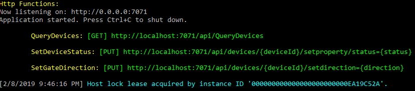

# Project Overview
This repository represents a demonstration of some of the capabilitities of Azure IOT hub. It does this by providing a simulation of simple mass transit devices such as a ticket purchase kiosk and platform gate.

The project uses [Azure IOT Hub](https://azure.microsoft.com/en-us/services/iot-hub/) as the backbone for communication between a series of simulated devices and action logic. The devices, found in /src/devices are built using .Net core so they can be run in multiple environments. The action logic, also built using .Net Core, have been built using [Azure Functions](https://azure.microsoft.com/en-us/services/functions/). Functions were choosen because they easily integrate with IOT Hub via [Azure Event Hubs](https://azure.microsoft.com/en-us/services/event-hubs/), providing a quick and simple way to ingest events.

## Setup
While the simulated devices and functions can all be run on a developer workstation, the IOT Hub backbone still requires some Azure Infrastructure. So before running the project, you will need to stand this up.

The first two items are pretty simple:

*Storage Account* - just a general purpose (tables, blobs, queues) [Azure Storage account](https://azure.microsoft.com/en-us/services/storage/). This is used by the functions. We only need a locally-redundant, not, standard performance account. 

*Event Hub Namespace* - [Event Hubs](https://azure.microsoft.com/en-us/services/event-hubs/) will be used to route events from IOT Hub to the various action logic Functions. We need a Standard (not basic) Event Hub Namespace with about 4 throughput units. Withing that namespace, we'll create 4 hubs, one for each route that the IOT Hub will be sending to. You can name them whatever you'd like but I used: purchaseticket, ticketissued, validateticket, noactionneeded. Each hub should have 4 partitions and a 1 day message retention.

*IOT Hub* - We'll also of course need an IOT Hub. This solution features multiple routes as well as cloud-to-device messaging. So you'll want to make sure you create a "standard" tier. A single IOTHub Unit should do for development work.

*IOT Hub Devices* - With the hub in place, we also need to register devices. If you're just doing development, you'll only need two. I suggestion keeping the names simple like: TicketKioskDemo and GateReaderDemo. While IOT Hub support multiple types of authentication, we'll use Symmetric, autogenerated keys for this solution, and make sure the devices are enabled.

*Event Routes* - We'll use [routes to send messages to the Azure Function action logic](https://azure.microsoft.com/en-us/blog/azure-iot-hub-message-routing-enhances-device-telemetry-and-optimizes-iot-infrastructure-resources/) via our Event Hubs. We'll configure these in the IOT Hub using the [IOT Hub query language](https://docs.microsoft.com/en-us/azure/iot-hub/iot-hub-devguide-query-language).

Start by setting up three specific routes for each of the event hubs we created earlier. Each route will have a query that is used to filter the events that will be sent to that hub. Assuming the event hub names I suggested earlier, here are the routes:

purchaseticket: data source is "Device Telemetry Messages", routing query is: $body.MessageType = 'cmdPurchaseTicket'

ticketissued: data source is "Device Telemetry Messages", routing query is: $body.MessageType = 'eventTicketIssued'

validateticket: data source is "Device Telemetry Messages", routing query is: $body.MessageType = 'cmdValidateTicket'

We have four event hubs, so yes, we'll need a route for  'noactionneeded'. But we're actually going to create two. The first, will be a "catch all" for events.

noactionneeded: data source is "Device Telemetry Messages", routing query is: STARTS_WITH($body.MessageType, 'event')

Unlike the previous routes, this route will catch any telemetry messages that have a MessageType that 'starts with' event. 

Each want to create a new IOT Hub endpoint for each of these as the endpoints are the "binding" between the route and the target event hubs. Each endpoint should get a meaningful name so they are easy to tell apart.

But we're finished just yet. We need a second route that also goes to our "noactionneeded" hub. We'll use this one to get updates on device twin updates.

devicetwinupdates: data source is "Device Twin Change Events", the endpoint is the same one created for the 'noactionneeded' route, routing query is: true

**Note:** The use of routes in this manner is done for *demonstration purposes only*. We felt it was important to show how traffic can be segregated and multiple routes used for the same endpoint. The first 3 highly specific routes help keep the action logic functionality very simple. The later 2 routes show how a single consumer of the events can interogate the event payloads and act on them appropriately. 

## Configuring the solution
With the cloud infrastructure all in place, next week need to setup the solution with all the proper details for that infrastructure. 

In the repository, if you browse to [src/Functions/TransitFunctionApp](./src/Functions/TransitFunctionApp) you will find a file named [smaple.local.settings.json](./src/Functions/TransitFunctionApp/sample.local.settings.json). This is an example of the settings that will be needed by the action logic functions. Copy this file and rename it local.settings.json. This repository will automatically ignore files by that name to help prevent you from accidently checking in "production" credentials. 

With the file renamed, its time to populate the settings contained in it. 

*AzureWebJobsStorage* - this it a connection string for the azure storage account we created that has read and write permissions. It can be used by the functions if they get deployed to Azure, but will also be used by them to help checkpoint thier location in the Event Hub event streams.

*receiverConnectionString*  - this is connection string for the Event Hub namespace. It will need send, listen, and manage permissions. The solution only uses one for all the event hubs, so make sure you get this from the namespace level.

*IotHubConnectionString* - this is (of course) the connection string for the IOT Hub. To keep things simple, give it all permissions. 

There are also 4 settings that end in "EventHubName". These are the event hubs we created within our namespace. If you used the values I suggested above, you shouldn't need to make any changes. However, if you picked your own values, then make place the proper hub names into these settings. 

With the functions configured, its time to set up the simulated devices. The process is the same for both the [Kiosk](./src/Devices/Kiosk) and [GateReader](./src/Devices/GateReader).

- locate the sample.appsetting.json file
- copy the file and rename it to appsettings.json
- inside the file, put the IOT Hub connection string (from the devices we created earlier) into the "IOTConnectionString" setting
- locate the devicesettings.json file in the same folder
- inside that file, update the "deviceId" setting to match the name you gave the device when you registered it

Do this for both devices.

## Running the solution (locally)
With the solution configured, you're now ready to compile and run the solution. Start by first launching the Transportation.Demo.Functions projects. This will use the Azure Functions local runtime to host the action logic and our device management APIs. If you've configured everything properly, console window should end up looking like this towards the bottom with no red error messages displayed:

Any red lines, and something isn't configured properly, or you may have a network that's restricting HTTP/HTTP, or AMQP traffic.

Once the functions are running properly, you can then launch the devices. They should also start without any red errors. If you get one, its again likely a case of mis-configuration or network blockage. 

The devices, once successfully launched, should automatically start generating simulated events and you should be able to see this in the console window of both the device, as well as the functions. Events should flow back and forth As the event sends a command to the action logic, and it responds.

**Note:** If you make changes to the appsettings.json or devicesettings.json file, make sure you build the simulated device project before re-running it. This copies the latest version of the files to the same location that the program executable is and thus ensures that your changes take affect.

## What next?
Now that you've (hopefully), successfully set up the project and gotten it running, you will want to take a closer look at what's happening. To follow a logical flow, start by looking at the readme for the [Kiosk device](./src/Devices/Kiosk). Then perhaps move on to the [GateReader](./src/Devices/GateReader), and finally on to the [Action Logic Functions](./src/Functions).

Each section will explain what is going on within its piece and how it ties into the entire workflow.